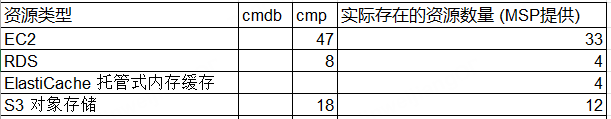
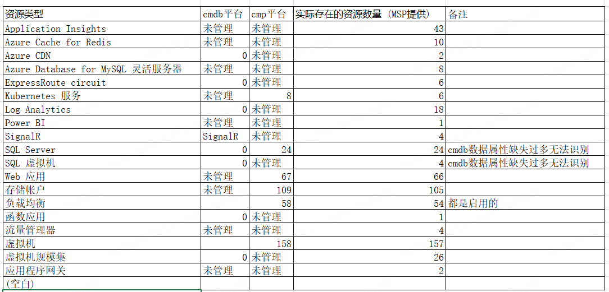
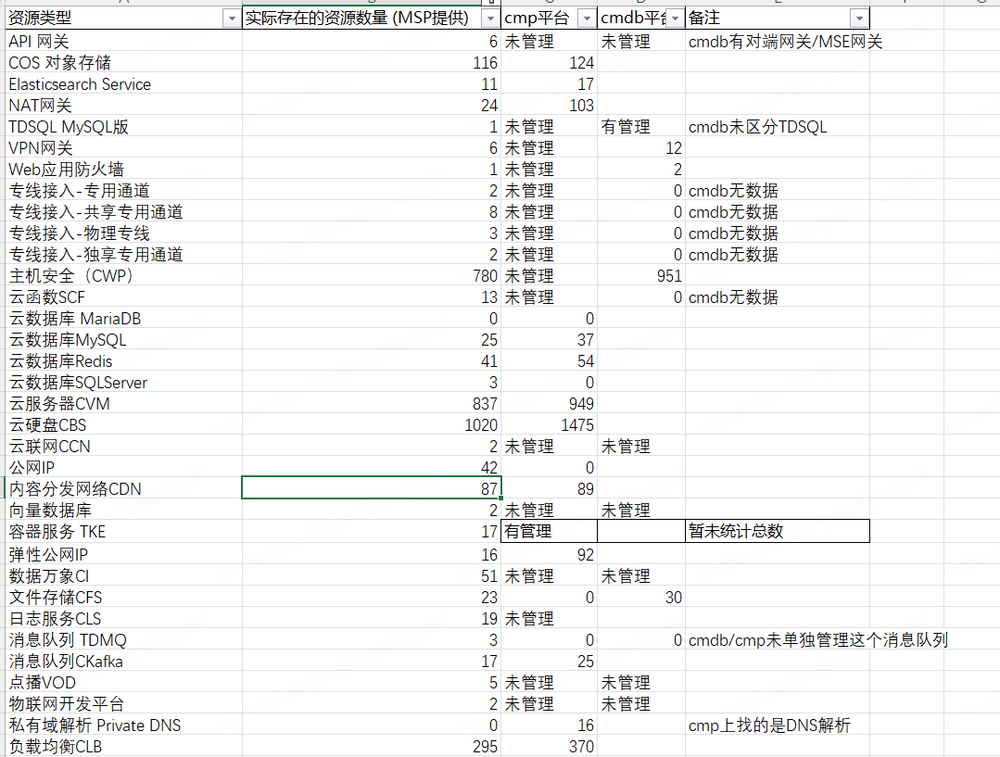
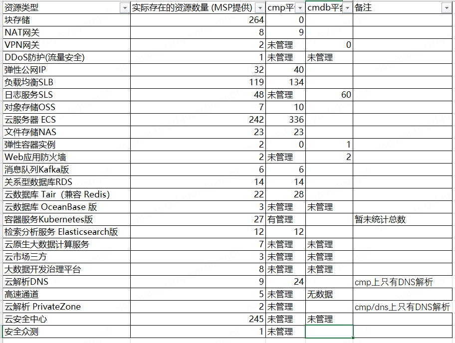

# 关于云上及IDC资源管理情况的调研报告

## 1. 背景
随着公司业务的快速发展，基础设施资源（包括云上资源和IDC物理资源）的数量和复杂度日益增加。为确保资源的可视性、成本的可控性以及运维的规范性，公司已通过自研系统/第三方平台（如GitLab、NetBox、CMDB、FinOps）对大部分资源进行了自动化/半自动化管理。

然而，目前怀疑存在部分资源未被现有管理系统有效覆盖，这些“影子资产”可能导致财务浪费、安全风险和管理混乱。为厘清现状，本次调研旨在通过与各MSP（管理服务提供商）及IDC团队确认，全面梳理实际存在的资源与现有管理系统中的资源记录，识别差异点，为后续实现100%资源自动化管理提供数据基础。
## 2、调研结果
#### 2.1 云上资源调研
##### 2.1.1 调研过程
- 对接人员： 与阿里云、腾讯云、AWS等云厂商的MSP建立联系。
- 数据获取：向MSP提出请求，获取所有主账号及旗下所有子账号在近半年内有创建或消费记录的所有资源清单。
- 数据比对：
    - 将MSP提供的全量资源清单，与以下系统中的记录进行交叉比对：
    - FinOps平台: 比对成本数据中的资源标识符，确认所有产生费用的资源是否已被管理。
    - CMDB: 比对其中注册的资源信息。
    - 标注都未管理的
    - 资源一定是有实例的吗？
    - 申请一个云平台的只读账号去对比一下资源
    - 腾讯云账号 dns和现在支付
#### 2.1.2 AWS平台管理数据对比

##### 2.1.3 Azure平台管理数据对比

##### 2.1.4 腾讯云平台管理数据对比

##### 2.1.5 Aliyun平台管理数据对比

##### 2.1.6 其他问题
- cmp平台
  - 上对象存储的属性不完全
  - azure中数据库的计费方式等数据维护不准确比如没有可用区
  - Azure的安全组属性不完整
#### 2.2 IDC资源调研
##### 2.2.1 调研过程
- 对接人员： 与IDC团队中对系统有较为了解的人进行沟通。
- 调研内容：
  - 核对了主要组件（服务器、机柜）的管理情况，还深入排查了周边基础设施、监控系统及软件资源的管理现状。
##### 2.2.2 IDC的流程、Jira工单、记录节点及同步机制
| 事项 | 详细说明 |
| :--- | :--- |
| 主要流程 | 1. 需求提出： 业务方通过Jira工单提交资源申请（如服务器上架、网络配置变更）。 2. 审核派发： 运维负责人审核后，将Jira工单分配给IDC驻场工程师或网络工程师。 3. 现场操作： 工程师根据工单要求进行物理操作（设备上架、接线、配置等）。 4. 记录更新： 操作完成后，工程师需要更新相关资源记录。 |
| Jira工单角色 | Jira工单是驱动所有IDC操作的核心流程引擎，记录了需求审批、任务分派和操作历史，但其本身不存储资源的技术配置详情。 |
| 数据记录节点与方式 | 记录方式分散且不统一： 1. 核心资产（部分）： 服务器、机柜等核心资产信息在操作后可能会被更新至cmdb/cmp，但依赖工程师手动录入。 2. 其他系统： 监控、备份等系统独立维护其专属资源列表，与CMDB无联动。 |
| 数据完整性 | ~~数据割裂严重，完整性不足：  • 已维护部分： 服务器物理信息、机柜位置、网络设备IP管理等核心信息在Excel中有记录，但NetBox中可能缺失或滞后。 ~~• 未维护/缺失部分：     a) 网络设备明细： 交换机端口级连接信息（哪个服务器端口连接到哪个交换机端口、VLAN信息）维护不全      b) 办公区（Office）基础设施： 办公室内的网络设备（如接入交换机、Wi-Fi AP）、物理服务器等资产未全面纳入管理，存在管理盲区。     c) 备份系统： Veeam备份软件中的备份任务、虚拟机和存储资源配置未与CMDB集成，无法从资源视角查看备份状态。     d) 监控系统： Zabbix监控平台中的监控主机、监控项和触发器状态未在CMDB中体现，CMDB无法反映资源的实时监控健康状况。     e) 其他： 存储设备的LUN映射、负载均衡设备的策略配置等细节信息也多存在于各自的管理界面中。 |
| 同步机制 | 提供对应的流程让MST部署系统时可以进行录入，通过工作流将信息同步到CMDB, 减少手工录入的差错·
##### 2.2.3 Veeam
- 资源管理脱节：
    - Veeam中保护的虚拟机、物理服务器等备份对象（Backup Objects）列表，与CMDB中记录的资产列表没有自动对照关系。
- 配置信息未同步：
    - 关键的备份配置信息，如备份策略（Backup Jobs） 的详细设置（保留策略、调度时间、备份目标存储库）、存储库（Backup Repositories） 的容量和使用情况，均仅存在于Veeam控制台中。
- 备份状态不可见：
    - 备份作业的最后一次成功状态、警告/失败信息、还原点健康状态等动态信息，未集成到统一的监控大屏或CMDB资产卡片中

###### 2.2.4结论： 
IDC资源管理呈现出“核心靠表格，周边靠人记”的碎片化状态。虽然核心业务流程通过Jira工单驱动，但资源数据的记录严重依赖线下手段，导致NetBox/CMDB中的数据不完整、不及时、不准确。大量关键的连接信息、配置信息和软件定义资源（监控、备份）未被有效管理，形成多个信息孤岛，存在显著的运维风险和管理成本。

## 3.cmp管理IDC/云上资源
| 分类 | 资源名称 |
|------|----------|
| 云上 | VPC |
| 云上 | 路由表 |
| 云上 | IP子网 |
| 云上 | 弹性公网IP |
| 云上 | NAT网关 |
| 云上 | DNS解析 |
| 云上 | IPv6网关 |
| 云上 | WAF策略 |
| 云上 | 应用程序服务 |
| 云上 | SSH代理服务 |
| 云上 | SSH代理节点 |
| 云上 | 负载均衡实例 / 访问控制 / 证书 |
| 云上 | 负载均衡集群和节点 |
| 云上 | CDN域名 |
| 云上 | 虚拟机 |
| 云上 | 硬盘 |
| 云上 | 硬盘快照 |
| 云上 | 安全组 |
| 云上 | 虚拟机实例套餐信息 |
| 云上 | 对象存储 |
| 云上 | 表格存储 |
| 云上 | 文件存储 |
| 云上 | RDS实例 |
| 云上 | Redis实例 |
| 云上 | MongoDB实例 |
| 云上 | Kafka |
| 云上 | Elasticsearch |
| IDC | 块存储 |
| IDC | IP子网 |
| IDC | 宿主机 |
| IDC | 主机快照 |
| IDC | 硬盘 |
| IDC | 硬盘快照 |
| IDC | 系统镜像 |
| IDC | 虚拟机 |
| IDC | SSH代理服务 |
| IDC | SSH代理节点 |
| IDC | 应用程序服务 |
| IDC | WAF策略 |
| IDC | DNS解析 |
| IDC | 二层网络 |

## 4. cmdb管理的IDC/云上资源
##### 4.1 IDC资源
| 资源类别 | 资源名称 |
|---------|---------|
| 基础设施资源 | 磁盘类型 |
| 基础设施资源 | cpu信息 |
| 基础设施资源 | 机柜 |
| 基础设施资源 | IDC物理服务器 |
| 基础设施资源 | 数据中心 |
| 基础设施资源 | 磁盘信息 |
| 基础设施资源 | 磁盘 |
| 基础设施资源 | 设备型号 |
| 基础设施资源 | CPU信息(元数据) |
| 基础设施资源 | CPU |
| 基础设施资源 | 概览配置 |
| 基础设施资源 | 内存信息 |
| 基础设施资源 | 内存 |
| 基础设施资源 | 电源信息 |
| 基础设施资源 | 电源 |
| 基础设施资源 | NIC |
| 基础设施资源 | 设备品牌 |
| 网络资源 | 网络设备-2024 |
| 网络资源 | 机柜-2024 |
| 网络资源 | 云资源_VM信息_主机 |
| 网络资源 | 网络设备 |
| 网络资源 | 数据中心-2024 |
| 网络资源 | 路由 |
| 容器和应用资源 | pod |
| 容器和应用资源 | namespace |
| 容器和应用资源 | node |
| 容器和应用资源 | K8S-Secret |
| 容器和应用资源 | K8S-PODS |
| 容器和应用资源 | K8S-NODES |
| 容器和应用资源 | K8S-命名空间 |
| 容器和应用资源 | K8S-集群 |
| 容器和应用资源 | K8S-应用服务 |
| 容器和应用资源 | K8S-SERVICE |
| 容器和应用资源 | cluster |
| 容器和应用资源 | service |
| SRE管控资源 | SRE管控-应用Module |
| SRE管控资源 | SRE管控-应用服务 |
| SRE管控资源 | SRE管控-中间件 |
| SRE管控资源 | SRE管控-自定规则-Kafka |
| SRE管控资源 | SRE管控-自定分流-Kafka |
| SRE管控资源 | SRE管控-自定配置-Kafka |
| SRE管控资源 | SRE管控-自定规则-应用服务 |
| SRE管控资源 | SRE管控-自定配置-应用服务 |
| SRE管控资源 | SRE管控-分流-中间件 |
| SRE管控资源 | SRE管控-分流-应用服务 |
| SRE管控资源 | SRE管控-规则-Midware |
| SRE管控资源 | SRE管控-规则-App |
| SRE管控资源 | SRE管控-规则-Infra |
| SRE管控资源 | SRE管控-机器X |
| SRE管控资源 | SRE管控-联系X |
| SRE管控资源 | SRE管控-Kubernetes |
| SRE管控资源 | SRE管控-Prometheus |
| 存储和数据资源 | IDC 库存管理-备件规格 |
| 存储和数据资源 | IDC 库存管理-备件总表 |
| 存储和数据资源 | IDC 库存管理-备件厂商 |
| 存储和数据资源 | IDC 库存管理-库房 |
| 存储和数据资源 | F5 |
| 存储和数据资源 | 刀框 |
| 管理和监控资源 | Apollo 账户 |
| 管理和监控资源 | 作业平台-朝夕模版 |
| 管理和监控资源 | UI Settings |
| 管理和监控资源 | 元数据分析 |
| 管理和监控资源 | mindPackage CurrentInfo |
| 管理和监控资源 | 运营商 |
| 管理和监控资源 | 人员 |
| 管理和监控资源 | 项目 |
| 管理和监控资源 | RAID |
| 管理和监控资源 | 部门 |
| 管理和监控资源 | 2024物理机模型 |
| 管理和监控资源 | 设备类型-网络 |
| 管理和监控资源 | os版本 |
| 管理和监控资源 | 邮件认证 |
| 管理和监控资源 | 手动维护IP |
| 管理和监控资源 | 系统服务器P地址配置 |
| 管理和监控资源 | 使用状态 |
| 管理和监控资源 | 接口类型 |
##### 4.2 云上资源
| 资源类别 | 资源名称 |
|---------|---------|
| 消息队列 | 云资源_Kafka |
| 存储服务 | 云资源_文件存储 |
| 安全服务 | 云资源_web应用防火墙 |
| 网络服务 | 云资源_SNAT规则 |
| 负载均衡 | 云资源_负载均衡转发规则 |
| 负载均衡 | 云资源_负载均衡监听器 |
| 服务网格 | 云资源_服务器组 |
| 安全服务 | 云资源_安全组规则 |
| 网络服务 | 云资源_端口 |
| 计算服务 | 云资源_原生K8S_Resource |
| 负载均衡 | 云资源_负载均衡服务器组 |
| 数据库 | 云资源_MongoDB节点信息 |
| 数据库 | 云资源_PolarDB |
| 网关服务 | 云资源_订阅号 |
| 网络服务 | 云资源_VPN网关 |
| 网络服务 | 云资源_共享带宽 |
| 虚拟机 | 云资源_虚拟交换机 |
| 网络服务 | 云资源_VPC |
| 证书管理 | 云资源_证明管理 |
| 负载均衡 | 云资源_负载均衡 |
| 服务网格 | 云资源_云服务器 |
| 安全服务 | 云资源_安全组 |
| 资源管理 | 云资源_资源 |
| 区域管理 | 云资源_区域 |
| 数据库 | 云资源_Redis |
| 存储服务 | 云资源_对象存储 |
| 服务网格 | 云资源_服务和可用区 |
| 服务网格 | 云资源_服务和规格 |
| 服务网格 | 云资源_服务和区域 |
| 监控服务 | 云资源_Spanner |
| 日志服务 | 云资源_日志项目 |
| 数据库 | 云资源_日志库 |
| 无服务器 | 云资源_Serverless应用引擎 |
| 消息队列 | 云资源_RocketMQ |
| 消息队列 | 云资源_RabbitMQ |
| 微服务 | 云资源_MSE_网关 |
| 微服务 | 云资源_MSE_微服务引擎 |
| 消息服务 | 云资源_MNS_主题 |
| 消息服务 | 云资源_MNS_队列 |
| 日志服务 | 云资源_Logging |
| 域名服务 | 云资源_全球加速域名 |
| 存储服务 | 云资源_Filestore |
| 云硬盘 | 云资源_云硬盘规格 |
| 大数据 | 云资源_BigQuery |
| 代码库 | 云资源_代码库 |
| 数据库 | 云资源_数据库审计 |
| 函数计算 | 云资源_函数计算服务 |
| 函数计算 | 云资源_函数计算服务 |
| 网站加速 | 云资源_全站加速 |
| 链路服务 | 云资源_flink |
| 容器服务 | 云资源_弹性容器实例 |
| 数据库 | 云资源_数据库备份 |
| 容器注册 | 云资源_ACR_镜像仓库 |
| 容器注册 | 云资源_ACR_命名空间 |
| 容器注册 | 云资源_ACR_实例管理 |
| 容器注册 | 云资源_ACR_镜像管理 |
| 管理服务 | 云资源_ManageOne_规格 |
| 容器服务 | 云资源_K8S_Nodes |
| 容器服务 | 云资源_容器节点规格 |
| 访问控制 | 云资源_ACL |
| 计算服务 | 云资源_原生K8S_LimitRange |
| 计算服务 | 云资源_原生K8S_Nodes |
| 资源组 | 云资源_资源组类型 |
| 系统配置 | 云资源_关系型数据库_数据 |
| 云主机 | 云资源_云主机安全 |
| 文件系统 | 云资源_文件系统_权限组 |
| 文件系统 | 云资源_文件系统_资源包 |
| 文件系统 | 云资源_文件系统_挂载点 |
| 访问管理 | 云资源_访问管理_用户 |
| 访问管理 | 云资源_访问管理_权限 |
| 访问管理 | 云资源_访问管理_角色 |
| 访问管理 | 云资源_访问管理_用户组 |
| 资源池 | 云资源_资源池 |
| 数据库 | 云资源_关系型数据库规格 |
| 数据库 | 云资源_redis规格 |
| 计算服务 | 云资源_原生K8S_StatefulSet |
| 计算服务 | 云资源_原生K8S_Pods |
| 计算服务 | 云资源_原生K8S_Deployment |
| 计算服务 | 云资源_原生K8S_DaemonSet |
| 数据库 | 云资源_mongodb规格 |
| 平台服务 | 云资源_Lindorm引擎信息 |
| 平台服务 | 云资源_Lindorm实例 |
| 消息队列 | 云资源_Kafka流量规格 |
| 云服务 | 云资源_云服务规格 |
| 云服务 | 云资源_daocloud_镜像版本 |
| 云服务 | 云资源_daocloud_镜像 |
| 云服务 | 云资源_daocloud_指令空间 |
| 传输服务 | 云资源_传输均衡规格 |
| 可用区 | 云资源_可用区 |
| 云存储 | 云资源_umstor_虚拟机 |
| 云存储 | 云资源_umstor_用户 |
| 云存储 | 云资源_umstor_存储池 |
| 云存储 | 云资源_umstor_磁盘 |
| 云存储 | 云资源_umstor_存储桶 |
| 数据库 | 云资源_Redis分片信息 |
| 数据库 | 云资源_Redis节点信息 |
| 虚拟端口 | 云资源_虚拟端口组 |
| 负载均衡 | 云资源_负载均衡证书 |
| 容器服务 | 云资源_K8S命名空间 |
| 容器服务 | 云资源_K8S节点池 |
| 容器服务 | 云资源_K8S集群 |
| 域名服务 | 云资源_DNS解析线路 |
| 存储池 | 云资源_存储池 |
| 缓存组 | 云资源_缓存子网组 |
| 数据库 | 云资源_HBase |
| 数据仓库 | 云资源_Clickhouse |
| 数据库 | 云资源_ADB |
| 存储服务 | 云资源_NAS |
| 搜索服务 | 云资源_Elasticsearch |
| 网关服务 | 云资源_NAT网关 |
| 边缘节点 | 云资源_边缘节点 |
| 对端网关 | 云资源_对端网关 |
| 域名服务 | 云资源_DNS解析记录 |
| 域名服务 | 云资源_DNS域名 |
| 数据库 | 云资源_MongoDB |
| 镜像服务 | 云资源_云镜像 |
| 公网IP | 云资源_弹性公网IP |
| 域名服务 | 云资源_域名 |
| 专线服务 | 云资源_专线 |
| 数据库 | 云资源_关系型数据库 |
| 云硬盘 | 云资源_云硬盘 |
| 证书服务 | 云资源_证书 |
| CDN服务 | 云资源_CDN加速域名 |
| 物理服务器 | 物理服务器 |
