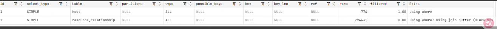

### 大表数据查询，怎么优化
1. 优化表schema、优化SQL、加索引
2. 使用缓存 Redis
3. 主从复制、读写分离
4. 垂直切分
5. 水平切分
### 练习项目和网站
- 练习网站：https://www.db-fiddle.com/f/3JSpBxVgcqL3W2AzfRNCyq/1?ref=hackernoon.com
- 分析：https://mp.weixin.qq.com/s/oPkney3KI0v5jxOVEHTbSQ
### explain
- link：
    - https://dev.mysql.com/doc/refman/5.7/en/explain-output.html#explain-extra-information
    - https://mp.weixin.qq.com/s?__biz=MzA3MTg4NjY4Mw==&mid=2457328508&idx=2&sn=0db2e532d2b2612ba1c4398af17e3d8c&chksm=88a5c948bfd2405e9065b02e8455e6e9603591952480097dea86cdf4a0142ce575fe2487196a&scene=27
    - https://juejin.cn/post/6844903545607553037
- id 序号，序号越大，越先执行;为null表示一个结果集，不需要使用他来查询，常出现在union语句中
- select_type:子查询的查询类型
    - simple：不包含子查询，union语句的
    - primary：包含子查询的最外层的查询
    - subquery：子查询
- type：它表示 MySQL 在表中找到所需行的方式，也就是访问类型
    - system > const > eq_ref > ref > range > index > ALL
    - ALL：扫描全部的表
    - index：遍历了索引，有时候比扫描全表的效率还低
    - range：索引范围查找
    - ref：使用非唯一索引查找（至少要达到这个）
    - const：使用主键或者唯一索引，且匹配的结果只有一条记录。
    - eq_ref 是针对多表 JOIN 时，被驱动表的主键/唯一索引查询。
    - const 和 eq_ref 保证最多只有一行匹配（“一对一”），因为它们用的是主键或唯一索引。而 ref 允许多行匹配（“一对多”），因为它用的是普通索引
    - 当你看到 const 或 eq_ref，说明你的主键/唯一索引设计正在完美地发挥作用。
    - 当你看到 ref，说明你的普通索引也正在有效地工作，这是非常常见和健康的状态。
    - 如果你的查询连 ref 都达不到，降级为了 range 或更差的 ALL，你就应该考虑是否可以优化索引或查询语句了。
    - system > const > eq_ref > ref 这四种类型都依赖于等值查询 (=) 和高质量的索引（主键、唯一索引、普通索引）
- partitions 
  - NULL 未使用表分区
- possible_keys 可能选用的索引列表
- key 实际使用的索引 为null就说明是全表扫描，没有走索引。
- ken_len	使用的索引键长度（字节数） 可以判断实际使用了复合索引的哪些部分
    - 较大的值说明使用了复合索引的大部分或全部列 这是高效的查询表现
    - 数值小于完整索引长度 → 只使用了索引的前几列
    - 数值等于完整索引长度 → 使用了全部索引列
    - 完整索引的长度 = 每种数据类型有固定的字节消耗相加
        - INT: 4字节
        - BIGINT: 8字节
        - CHAR(n): n×字符集字节(utf8mb4=4)
        - VARCHAR(n): n×字符集字节+长度前缀(1或2)
        - 可为NULL的列会额外增加1字节
- ref：表示使用列或者常量来和key列里面的值进行比较来从表中选取行
  - const 表示使用了常量值进行索引查找  WHERE source_uid = 0bd5e5cb-9248-42b5-83e8-7657260315df'  
  - 出现列名的情况  表示使用了其他表的列值进行索引查找 JOIN host ON host.resource_uid = resource_relationship.target_uid
  - func 使用了函数的结果
  - NULL 全表扫描
  - 表	ref值	说明	效率
    resource_relationship	const,const,const,const	全部使用常量条件查找	最优，直接定位
    host	列名,const,const	使用关联列+常量条件	次优，但依然高效
  - resource_relationship 表：4个精确的常量条件 → 直接定位到3行数据
  - host 表 使用前表关联列 + 2个常量条件 → 每行关联只检查1行数据
  - 这种组合使得整个查询只需检查：3行 (resource_relationship) × 1行 (host) = 总共3行数据
- rows 预估需要检查的行数 就是存储引擎返回的数据
- filtered 表示存储引擎返回的数据在server层过滤后剩余百分比 
    - 范围从0.00到100.00（百分比值）
    - 是MySQL优化器基于统计信息做出的预估值，不是实际测量值 可能不准确
    - filtered = (预估通过所有条件过滤后的行数) / (存储引擎返回的行数==rows) × 100
    - 当查询包含无法用索引完全覆盖的条件时 何时不是100%？ EXPLAIN SELECT * FROM users WHERE age > 20 AND name LIKE 'J%';
    - 查看实际返回行数 SELECT COUNT(*) FROM (  /* 你的原始查询 */) AS t; 与rows × (filtered/100)的乘积进行比较，看预估是否合理。
- extra：
    - link:https://blog.csdn.net/poxiaonie/article/details/77757471
    - using index 索引覆盖
    - Using filesort 使用文件排序，使用非索引列进行排序时出现，非常消耗性能，尽量优化
    - NULL  表示没有特殊的额外操作，是最基本的索引使用方式
      - 说明对 resource_relationship 表的访问完全通过索引完成
      - 所有过滤条件都已在存储引擎层通过索引解决
      - 这是高效的表现，没有额外开销
    - Using index condition
      - 使用了"索引条件下推"(Index Condition Pushdown, ICP)优化
      - MySQL 将 host.d_version = 'latest' 和 host.is_deleted = 0 条件下推到存储引擎层执行 减少了需要返回到server层的数据量
      - 这是更高级的优化，比单纯的 NULL 更高效
    - Using filesort：需要额外排序 不好
    - Using temporary：使用了临时表 不好
    - Using where：在server层进行了大量过滤 不好
    - Using join buffer：需要缓冲连接 不好

### 好的查询
- 两个表都100%利用了索引（filtered=100.00）
- 预估检查行数极少row（3行和1行）

### 加索引
- 从1400万条数据中检索耗时从4.27s提高到0.01s 

# sql调优
- 不用select * ，减少取出来的数据的大小，需要什么取什么
- 不对数据进行计算，会导致全表扫秒，即使该字段有索引
```sql
select name from user where FROM_UNIXTIME(create_time) < CURDATE();
// 应该修改为
select name from user where create_time < FROM_UNIXTIME(CURDATE());
```

# 如何正确得给线上表加字段
- http://www.jinyazhou.com/16656511239302.html#more
- `ALTER TABLE `user` ADD `age` int NOT NULL DEFAULT '0' COMMENT '年龄';` 执行这条sql的时候，会自动给表加上表锁，而且是写锁 会阻塞后续的所有读写请求，造成非常严重的后果，整个服务都有宕机的风险

# 删除大批量数据有规律时会好一点

### 慢日志
- link: https://blog.csdn.net/weixin_46575363/article/details/119779018
- 记录分析（mysqldumpslow）
  - mysqldumpslow -s t -t 10 -g ‘log’ mysql_slow.log # 显示前10条按耗时排序的记录
  - -s : 按照哪种规则排序
  - -t: 显示前几个记录
    - c: 访问计数
    - l: 锁定时间
    - r: 返回记录
    - t: 查询时间
    - al:平均锁定时间
    - ar:平均返回记录数
    - at:平均查询时间
  - -g : 有点像grep， 后跟正则

### 编写规范
- 尽量保持JOIN子句的简洁，只包含必要的关联条件。
- 使用WHERE子句来过滤记录，这样可以提高查询的灵活性和可读性。
- 考虑性能，确保使用索引优化过滤条件。
```sql
-- sql1
SELECT * FROM ticket
JOIN server_config_release_ticket_data ON server_config_release_ticket_data.ticket_id = ticket.id
JOIN server_config_release_data ON server_config_release_data.ticket_id = ticket.id AND server_config_release_data.is_activate = 1
WHERE ticket.is_deleted = 0
-- sql2
SELECT * FROM ticket
JOIN server_config_release_ticket_data ON server_config_release_ticket_data.ticket_id = ticket.id
JOIN server_config_release_data ON server_config_release_data.ticket_id = ticket.id
WHERE ticket.is_deleted = 0 AND server_config_release_data.is_activate = 1
-- 比较sql2更好
-- SQL2更好，因为它遵循了清晰的逻辑分离原则。将过滤条件放在WHERE子句中，使得查询的意图更加明确，易于理解和维护。
-- 性能：在某些数据库系统中，将过滤条件放在JOIN子句中可能会影响查询性能，因为数据库可能无法在连接过程中有效地使用索引。将过滤条件放在WHERE子句中有助于数据库优化器更好地进行查询优化。
-- 可读性：SQL2的可读性更好，因为它遵循了常见的SQL编写习惯，即先连接表，然后过滤记录。
-- 通用性：SQL2更通用，因为它允许你在不影响连接逻辑的情况下，更容易地添加或修改过滤条件。
-- 注意
-- 有个问题就是前者是只过滤server_config_release_data表中的数据，后者是过滤结果中的数据，如果是左连接的话，那么后者可能不会出现server_config_release_data为空的数据
-- 不过要是这样的话更推荐连接子查询
LEFT OUTER JOIN server_config_release_ticket_data ON server_config_release_ticket_data.ticket_id = ticket.id 
LEFT OUTER JOIN (select * from server_config_release_data where server_config_release_data.is_deleted = 0 AND server_config_release_data.is_activate = 1) as server_config_release_data ON server_config_release_data.ticket_id = ticket.id 
WHERE ticket.is_deleted = 0 AND server_config_release_ticket_data.is_deleted = 0
```

### or 和 in 查询比较
- in 比 or 执行效率更高
- 等值查询时，in会被优化为哈希查找，or可能会多次索引合并
- 同一字段、等值条件、字段有索引时，mysql会将or转为in
- 多字段 OR 查询，MySQL 可能无法使用合适索引，变成 全表扫描，效率差。
- 查询成千上百项时，二者的执行效率都很慢，但in仍然更优
```sql
# 执行计划复杂，优化器可能退化，全表扫描或过多索引跳转。
# 建议：把大 IN 替换为临时表 JOIN：
SELECT o.* 
FROM order o
JOIN temp_ids t ON o.id = t.id;

SELECT * FROM user WHERE id IN (1, 2, 3);
```

### 练习1
- 表行数 53254 只有一个主键索引
```sql
select * from virtual_machine   where  id=479707; --0.085s
select * from virtual_machine   where d_version="latest" and id=479707; -- 0.088s
select * from virtual_machine   where d_version="latest" and vm_name="vCLS-e17fb52d-32f3-4986-87ea-69652b011629"; # 0.387s
```
- 问题一： 为什么没有索引的 d_version 条件查询没有明显变慢
    - 因为先用主键查询去定位
    - 查出来的结果很少，所以对比d_version的次数就很少
    - 如果 d_version="latest" 是常见值，数据库可能已经缓存了相关数据

- 针对下面explain的结果进行优化
- 
- 
