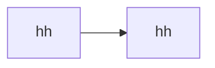

1. #### 从请求中拿到数据后，再添加一些数据的过程叫什么？ ----------------------------------------------no
2. #### 接口中的用到的临时数据，叫什么？ ----------------------------------------------no
3. #### Grokking The System Design Interview（系统设计）
   - Grokking The System Design Interview（系统设计）
4. #### [linux下EOF写法梳理](https://www.cnblogs.com/gzxbkk/p/10298799.html)
   1. EOP (end of file )表示自定义终止符, 可以随意设置别名, 在linux按ctrl-d就代表EOF
   2. << :标准输入来自命令行的一对分隔号(EOF就是分隔符)的中间内容.
    ```shell
    # 怎么输入wang呢 ------------------no
    cat << wang > haha.txt
    > ggggggg
    > 4444444
    > 6666666
    > wang
    ```
5. #### noop 没有操作
   no operate
   RTFM(Read The Fucking Manual)
6. #### noqa 
   no quality assurance
7. #### 非选项参数
8. #### 提示符号错误的时候,首先去排除是否是看起来相同, 可能是中文的,最好的办法是从未报错的地方复制一个过来
9. #### 程序运行时依赖的内存结构, 命名空间 ------------------------------------------未
   1. 堆栈里放的帧
10. #### 二进制安全
    redsi的string是二进制安全的，是指其可以包含任何数据，如jpg图片或者序列化的对象
11. #### 幂等
    多次执行后结果一致
12. #### 正则表达式
    在linux中，正则表达式分为正则表达式、扩展正则表达式和Perl 的正则表达式，不知道别的也是不是这样分的
    [扩展正则表达式](https://blog.csdn.net/yufenghyc/article/details/51078107)
13. #### 流程图
   [link](https://blog.csdn.net/L_786795853/article/details/108878289)

1. #### pycharm 不能预览markdown
   在setting>Languages_**>markdown 中显示 “ there are no available preview providers” 
   [解决方法](https://intellij-support.jetbrains.com/hc/en-us/community/posts/360001515959-markdown-support-plugin-preview-not-working-in-linux)
   是jdk的问题
2. #### Redis command
    hkeys 
    hgetall

3. #### Vim
    :bd关闭 多个标签中一个
    
#### Flask如何保证线程安全
[关于flask线程安全的简单研究](https://www.cnblogs.com/fengff/p/9087660.html)
简单结论：处理应用的server并非只有一种类型，如果在实例化server的时候如果指定threaded参数就会启动一个ThreadedWSGIServer，而ThreadedWSGIServer是ThreadingMixIn和BaseWSGIServer的子类，ThreadingMixIn的实例以多线程的方式去处理每一个请求
只有在启动app的时候将threded参数设置为True，flask才会真正以多线程的方式去处理每一个请求。