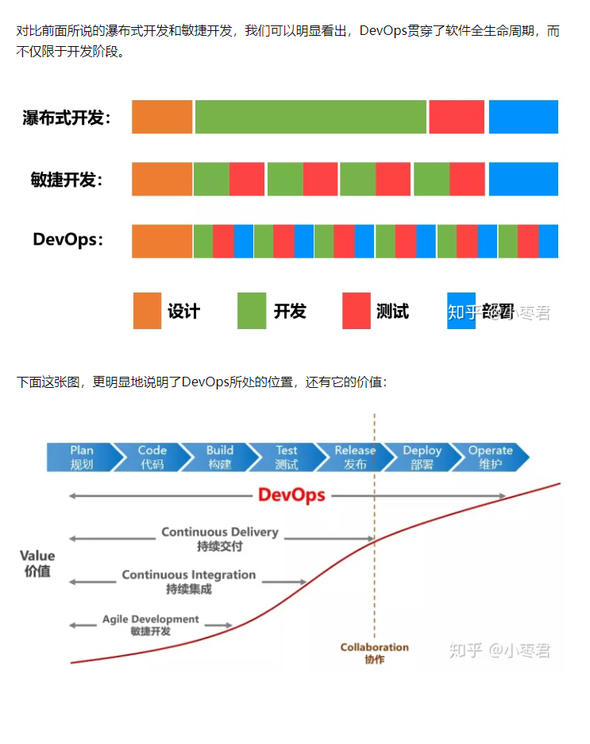

# To
介绍下devops是怎么，在生产中是一种怎样的体现

# link
- https://zhuanlan.zhihu.com/p/91371659

# 概述
- 软件从提出需求到投入实际的生产一共需要经历设计、编码、测试、部署这几个阶段，早期的开发流程是瀑布流模式开发，即把所有的需求完成后才进入下一个阶段，但这样有一个缺点就是开发周期太长在此基础上提出了CI/CD, CI是持续集成，CD是持续部署或者持续交付；CI/CD和瀑布流模式的区别就是把整体的需求分为几个部分去完成，模块A编码完成后就测试，编码模块B然后测试...。DevOps是在上述的每个模块的阶段中加入了部署，这种开发模式促进了开发人员、质量保证人员、运营人员整体的沟通和合作，通过自动化流程来使得软件交付变得更加高效和可靠

- 

# jenkins
## 下载
- 根据手册下载：https://www.jenkins.io/zh/download/
- systemctl start jenkins 就可以启动了

## 问题
- 端口被占用/Failed to start Jetty/：https://blog.csdn.net/myiwen_15213620430/article/details/125822698
- 忘记密码：https://blog.csdn.net/leenhem/article/details/122013630
    - 只需要删除配置后就可以重新登陆了