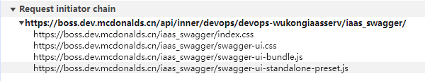

### swagger访问不了
- 本地启动flask，可以访问到swagger页面，但是部署到生产 由于该服务的url归到了首页下的子路由，访问不到url了
- 考虑是不是nginx页面没将服务转发到后端，直接访问后端api，发现可以访问
- 查看响应体，发现有oauth2RedirectUrl设置项， 将该值设置为带网关的url：https://boss.dev.mcdonalds.cn/api/inner/devops/devops-wukongiaasserv/iaas_swagger/oauth2-redirect.html 仍然无效
- 发现iaas_swagger页面虽然响应正常，但仍然需要请求资源

- 而子资源的url访问不正常https://boss.dev.mcdonalds.cn/iaas_swagger/index.css
- 改为https://boss.dev.mcdonalds.cn/api/inner/devops/devops-wukongiaasserv/iaas_swagger/index.css就能请求到资源
- 尝试将APISPEC_SWAGGER_URL'设置为'/api/inner/devops/devops-wukongiaasserv/iaas_swagger'
- 重新访问404

- 改为https://boss.dev.mcdonalds.cn/api/inner/devops/devops-wukongiaasserv/api/inner/devops/devops-wukongiaasserv/iaas_swagger就能请求到资源 明白了改这个并没有用

