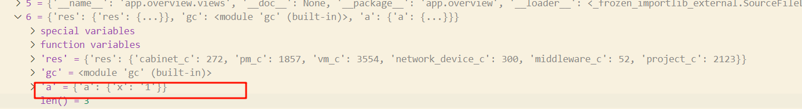
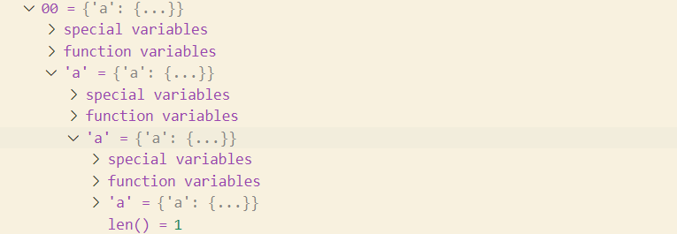

# link
- https://ebook-python-study.readthedocs.io/zh-cn/latest/python%E8%BF%9B%E9%98%B618%E5%9E%83%E5%9C%BE%E5%9B%9E%E6%94%B6GC.html
- https://fasionchan.com/python-source/memory/refcnt-drawback/
# Python的GC机制是引用计数为主，标记清除和分代回收为辅 + 缓存机制[link](https://blog.csdn.net/qq_37388085/article/details/105852718)
- python的内存回收可以概括为引用计数为主，标记清除、分代回收和缓存池为辅；
- python会维护一个双向链表a，每个对象都会被放到该链表中；python中每个对象除了包含类型和值，还包括一个用来维护被引用次数的值、当对象被创建时，这个值默认为1，当对象被别人引用时，这个值就会加一，当对该对象使用del时，引用计数值减1。当值变为0时，就说明可以对该对象执行垃圾回收了。
- 但是这样的引用技术机制检测不出来循环引用的变量，标记清除就是另外维护一个链表b,这个链表和前面的链表a差不多，只不过里面只存放容易产生循环引用的对象，通过去遍历链表，当检测出来存在循环引用的变量就这些变量的引用计数值减1。
- 分代回收呢就是一种在标记清除中去如何遍历的机制，他引入了一个代的概念，把经过一轮标记清除后仍没被回收的对象放到下一代中，对于不同代的对象，扫描的频率不同。具体的做法时每代对应一个链表，当第0代中元素总数超过某个值时，触发对这一代的标记清除，如果该代中某个元素引用计数变为0，就去回收该元素，然后把剩下的引用计数不为0的元素放到更高的代中。而当前一代的扫描次数超过某次时，就会触发更高一代的扫描
- 分代回收解决了标记清除的两个问题，一个是什么时候扫描的问题，二是解决了扫描数据量大的问题，将其分成多代，以此提升扫描效率。
- 回收是做两件事，一是将对象从双向链表中删除，第二个是将这个对象进行销毁，销毁意味着将内存归还给系统。
- 缓存机制主要时缓存池机制和free_list
    - 缓存池主要有小整数池
    - free_list机制就是在对象被回收的时候，不将对象从内存中释放，而是添加到一个free_list的列表中，当成缓存。当以后创建对象时，不再重新开辟内存，而是直接使用free_list中该对象，然后取到对象之后对对象中的数据进行初始化。
### [弱引用和del](https://www.cnblogs.com/marsggbo/p/14831456.html)
### 关于对数据的称呼 如变量和数据对象的理解 如a = 1
    - 1 就是数据对象, a就是变量
    - 变量三要素 标识/类型/值 其中的值就是数据对象 标识是内存中的地址, 但这个地址存的是数据还是这个变量呢? 即数据对象和变量究竟对等不对等
    - 变量就是对象的别名, 我们可以通过变量找到对象,进而操纵对象
    - 标识是数据对象在内存中的地址
    - 在python总, 数据对象并不是只指向内存地址, 地址中存放值, 数据对象是一个结构体,当中有数据的值, 还有辅助的变量如维护引用计数的值
    - 垃圾回收的是1，引用计数也是看1被引用的次数，而不是a，假如a=1;b=a,那么sys.getrefcount(a)和sys.getrefcount(b)的结果都是一样的
### 回收内存
    - 数据对象保存在内存当中,变量只是一个链接, 指向这个内存地址, 而变量赋值的本质是新的变量也指向内存中的相同地址, 只有当所有链接被删除后,这块内存才会被回收掉,内存中保存的数据就不存在了.
    - 内存回收也有假删除的情况, 只是删除变量的链接,然后新建东西的时候,使用这个变量原本指向的内存空间
    - Python垃圾回收的唯一必需属性是，它在所有引用都被删除之后发生
### 强引用和弱引用
    - 强引用和弱引用的区别就是引用的变化是否会改变引用计数
    - python中默认的就是强引用
    - 弱引用 即增加了引用,但并不会使数据对象的引用计数发生变化
    - 通过wreakref模块实现弱引用
### del
    - del 会是数据对象的引用技术减一, 而不是回收变量所指向的数据对象
    - del 作用在变量上,而不是作用在数据对象上 删除的是变量和数据的引用关系
    - del 做的和垃圾回收做的是一样的吗?
      - 大概是不一样的,del只是把这个引用关系给清空掉,清空调用,内存回收机制就被触发,先进行引用计数,然后如果这块内存中的引用值为0, 就会被回收
      - 在python总, 数据对象并不是只指向内存地址, 地址中存放值, 数据对象是一个结构体,当中有数据的值, 还有辅助的变量如维护引用计数的值
### __del__ 见learn_python_magic
### 一些需要注意的
- 由于多种原因，变量可以长期存在，例如传播性异常或模块自省可以使变量引用计数大于0。而且，变量可以是引用循环的一部分—启用垃圾回收的CPython大部分(但不是全部)中断此类循环，甚至只是周期性地中断
    - https://blog.csdn.net/weixin_39724009/article/details/110785744
# 未读完link: https://blog.csdn.net/weixin_39724009/article/details/110785744?utm_medium=distribute.pc_relevant.none-task-blog-2~default~baidujs_title~default-1.no_search_link&spm=1001.2101.3001.4242

### 循环引用
```py
a = {"x": "1"}
a={"a": a}
# 这样会发生循环引用吗
```
- 不会，因为发生在创建对象的时候，而创建对象时，在 a = {"a": a} 这一行，a 并没有直接或间接引用自己，它只是创建了一个新的字典，将原来的 a 作为值。
- 也就是说，原来的 a（即 {"x": "1"}）只是被包含在新的 a 里，它们是两个不同的对象。
```py
import gc
print(gc.get_referrers(a))
```

- 让字典的某个键指向自己，才会发生循环引用
```py

a = {}
a["a"] = a  # 让 a["a"] 指向 a 自身
print(gc.get_referrers(a))
# 循环引用 会报错
json.dumps(a)
RecursionError: maximum recursion depth exceeded
```
