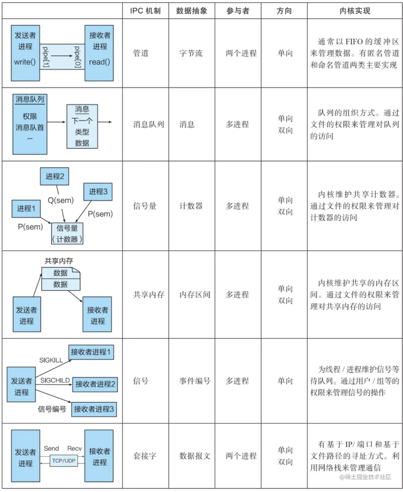

# IPC(inter process communication) 进程间通信
[link](https://blog.csdn.net/zhaohong_bo/article/details/89552188)
- https://juejin.cn/post/7028373895249920036
- https://docs.python.org/3/library/multiprocessing.html#exchanging-objects-between-processes
## 为什么需要通信
- 数据传输
- 资源共享
- 事件通知
- 进程控制（如debug进程）
## 进程通信的原理
- 因为每个进程的用户空间是相互独立的，任何一个进程的全局变量在另外一个进程中都看不到，所以进程之间通信必须依赖内核，在内核中开辟一块缓冲区，进程1把数据从用户空间拷贝到缓冲区，进程2再把数据从缓冲区读走，内核提供的这种机制称为进程间通信机制。
- 内核空间是共享的，用户空间是不共享的
### 概述
常见的进程间通信一共有种方式：管道、消息队列、共享内存、套接字、信号、信号量
管道：
    管道分为命名管道和无名管道，他们都是通过内核缓冲区实现数据传输
    无名管道只能用于具有亲缘关系的进程间通信
    他们都是半双工的
    - windows上不能使用命名管道，只可以在linux、Unix上使用
    - 
    - 命名管道是将消息写到文件中：[Python进程间通信之命名管道](https://cloud.tencent.com/developer/article/1121799)
消息队列：
    是一个消息的链表，是一系列保存在内核中消息的列表，
    可以对每个消息指定特定的消息类型，在接受的时候不需要按照次序，而是可以根据自定义的条件接受特定类型的消息
    - 解决了信号量传递消息量小，管道只能承载无格式字节流以及管道使用缓冲区大小受限的缺点
- 共享内存：
    比如test.py中一个list有多个对象去读取，那么这个就可以理解为简单的共享内存
    是多个进程共享一个给定的存储区，每个进程都可以将这段存储区映射到自己的地址空间中
    效率高是最快的IPC方式，因为进程可以直接读写内存，不需要任何数据的拷贝，而管道和消息队列这些以内核为消息载体的通信方式，需要在内核和用户空间进行4次数据拷贝。
    共享内存的生命周期是整个通信周期，而不是每次读写完后就销毁，其中的内容在解除映射时写回文件
    有两种实现机制：内存映射、共享内存机制
    - 常常和其他IPC机制如信号量配合使用来实现进程间的通信和同步
  - 是通过multiprocess内置的Value和Array实现 
```py
from multiprocessing import Process, Value, Array

def f(n, a):
    n.value = 3.1415927
    for i in range(len(a)):
        a[i] = -a[i]

if __name__ == '__main__':
    num = Value('d', 0.0) # 这里的d、i是代表变量类型的意思
    arr = Array('i', range(10))

    p = Process(target=f, args=(num, arr))
    p.start()
    p.join()

    print(num.value)
    print(arr[:])
```
- server process 通过Manger使用 可以跨进程只要是同一网络中的，但是比共享内存慢
```py
from multiprocessing import Process, Manager

def f(d, l):
    d[1] = '1'
    d['2'] = 2
    d[0.25] = None
    l.reverse()

if __name__ == '__main__':
    with Manager() as manager:
        d = manager.dict()
        l = manager.list(range(10))

        p = Process(target=f, args=(d, l))
        p.start()
        p.join()

        print(d)
        print(l)
```
```py
num = Value('d', 0.0)

```
套接字：
    套接字可用于不同进程间的通信(不是多线程模块内置的通信方式，而是将套接字用在了这里)
信号量
    - link：https://python-parallel-programmning-cookbook.readthedocs.io/zh-cn/latest/chapter2/08_Thread_synchronization_with_semaphores.html
    - 常作为一种锁机制，实现进程间的同步
    信号量(S)是一个计数器，用于实现进程间的互斥与同步。而不是存储进程间通信数据；S是一个整数，与每次对信号量的PV操作值结合起来来控制并行数
    信号量是基于操作系统的PV操作，程序对信号量的操作时原子性的
    PV操作：[link](https://blog.csdn.net/strikedragon/article/details/82791450)
        P操作和V操作:是实现进程间互斥和同步的有效方法
        P：S=S-1 若S>=0则该进程继续执行，否则排入等待队列
        V操作：使 S=S+1 ，若 S>0 ,唤醒等待队列中的一个进程
    每次对信号量的 PV 操作不仅限于对信号量值加 1 或减 1，而且可以加减任意正整数
信号
    信号是一种比较复杂的通信方式，用于通知接收进程某个事件已经发生。



